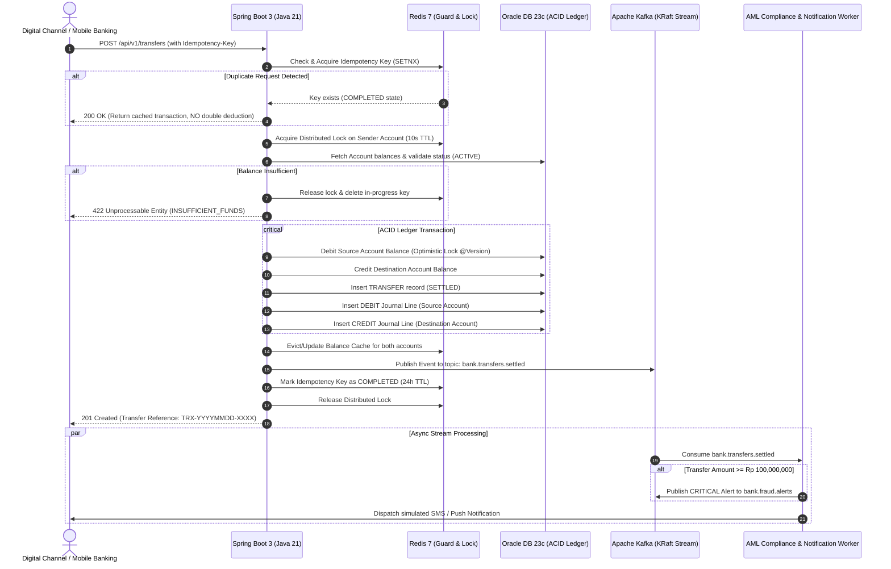

# IndiBank Core Transaction & Ledger Engine
> **High-Throughput Digital Banking Ledger Engine** built with **Spec-Driven Development (SDD)**  
> **Tech Stack:** Java 21 • Spring Boot 3.3 • Apache Kafka • Redis 7 • Oracle DB 23c • Kubernetes • Terraform

[](./.github/workflows/ci-cd.yml)
[](http://localhost:8080/swagger-ui.html)
[](./docs/deployment/MULTI_PLATFORM.md)
[](https://openjdk.org/projects/jdk/21/)

---

## 1. Executive Summary & Contracts

**IndiBank Core Engine** is a production-grade, event-driven banking transaction and ledger processing system designed for financial institutions requiring strict zero-loss consistency, sub-second latency, and regulatory auditability (e.g. **BI-FAST**, **Instant Interbank Transfer**, and **Core Banking Ledger**).

### 🌐 Endpoints & Contracts
* **Interactive Banking Dashboard:** `http://localhost:8080` (or configured production ingress domain)  
  *(Allows evaluators and developers to execute live transfers, test idempotency replays, view real-time balance updates, and observe the live Kafka stream ticker).*
* **Interactive Swagger / OpenAPI UI:** `http://localhost:8080/swagger-ui.html`
* **Automated CI/CD Pipeline:** [`.github/workflows/ci-cd.yml`](./.github/workflows/ci-cd.yml)
* **Multi-Platform Deployment Guide:** [`docs/deployment/MULTI_PLATFORM.md`](./docs/deployment/MULTI_PLATFORM.md)
* **Production Helm Chart:** [`helm/indibank/`](./helm/indibank/)
* **OpenAPI 3.1 Contract:** [`spec/openapi.yaml`](./spec/openapi.yaml)
* **AsyncAPI 3.0 Contract:** [`spec/asyncapi.yaml`](./spec/asyncapi.yaml)
* **Oracle 23c DDL Specification:** [`spec/database-schema.sql`](./spec/database-schema.sql)
* **Redis Concurrency Specification:** [`spec/redis-spec.md`](./spec/redis-spec.md)
* **Production SRE Framework & Runbooks:** [`docs/sre/SRE_FRAMEWORK.md`](./docs/sre/SRE_FRAMEWORK.md)
* **Prometheus Alerting Rules:** [`monitoring/prometheus-alerts.yaml`](./monitoring/prometheus-alerts.yaml)

---

## 2. Technology Mapping & Architectural Roles

| Component | Technology | Role in Banking System |
| :--- | :--- | :--- |
| **Enterprise Core** | **Java 21 (OpenJDK) & Spring Boot 3.3** | High-concurrency transaction processing with **Virtual Threads (Project Loom)**, Clean Architecture, Spring Data JPA, Spring Kafka, Spring Data Redis, and SpringDoc OpenAPI. |
| **System of Record** | **Oracle Database 23c Free** | **Immutable Financial Ledger**: ACID compliance, strict **Double-Entry Bookkeeping** (every transaction creates equal DEBIT and CREDIT journal lines), non-negative constraints (`balance >= 0`), and optimistic locking (`@Version`). |
| **Concurrency Guard** | **Redis 7 (In-Memory Data Store)** | **Distributed Performance & Safety**: Strict **Idempotency Key Engine** (`SETNX` + TTL) preventing duplicate transfers, **Distributed Locks** on sender accounts mitigating race conditions, and **Fast-Path Balance Caching**. |
| **Event Streaming** | **Apache Kafka 3.7+ (KRaft Mode)** | **Asynchronous Decoupling**: Event-driven settlement notifications (`bank.transfers.settled`), real-time **AML Fraud Detection** (`bank.fraud.alerts` flagging transfers > Rp 100M), and Dead-Letter Queueing (`bank.transfers.dlq`). |
| **Container Platform** | **Kubernetes (Cloud-Agnostic / CNCF Conformant)** | Container orchestration running with dedicated PVC storage for Oracle DB, horizontal autoscaling (HPA), and zero-downtime rolling updates across any Kubernetes environment (EKS, AKS, GKE, OpenShift, On-Prem). |
| **Infrastructure as Code** | **Terraform (HashiCorp)** | Modular, multi-cloud declarative infrastructure provisioning across major cloud providers (AWS, Azure, GCP). |

---

## 3. High-Level Architecture Flow



---

## 4. Key Banking Features

### A. Strict Double-Entry Bookkeeping (Oracle DB)
Financial transactions are never updated in-place; they are recorded as immutable journal entries:
* **DEBIT Entry:** Created for the originating account, capturing the outgoing amount and balance after transaction.
* **CREDIT Entry:** Created for the beneficiary account, capturing the incoming amount and balance after transaction.
* The balance equation `Sum(Debits) == Sum(Credits)` is mathematically guaranteed.

### B. Banking Idempotency State Machine (Redis)
In digital banking, network dropouts often trigger client retries. IndiBank uses a 3-phase Redis state machine:
1. `ACQUIRE (IN_PROGRESS)`: Key is reserved with a 60-second in-progress lock.
2. `COMPLETED`: On ledger commit, the response payload is cached under the key for 24 hours. Replays immediately receive the original response without hitting the database or debiting funds.
3. `ROLLBACK`: If validation fails before deduction, the key is released immediately.

### C. Real-Time AML Fraud Detection (Kafka)
* Whenever a transfer is settled, a `TransferSettledEvent` is published to Kafka.
* The **AML Compliance Consumer** monitors transactions in real time. Any single transfer exceeding the regulatory threshold (**IDR 100,000,000.00**) triggers an immediate `FraudAlertEvent` to the `bank.fraud.alerts` topic with severity `CRITICAL`.

---

## 5. Automated Verification Test Suite

A complete verification script is included to test all scenarios against the live environment:

```bash
# Run against the target environment (e.g. Local Docker Compose or Kubernetes cluster):
./test-scenarios.sh http://localhost:8080
```

The script executes 7 automated scenarios:
1. **Query Demo Accounts:** Verifies accounts seeded in Oracle DB.
2. **Execute Transfer:** Initiates a transfer from Budi Santoso to Siti Rahma.
3. **Idempotency Replay:** Immediately resends the exact same transfer with the same UUID and asserts that the response is identical with no double charge.
4. **Trigger AML Fraud Rule:** Executes a high-value transfer (> IDR 100M) and verifies fraud alert dispatch.
5. **Real-Time Kafka Ticker:** Queries `/api/v1/events/recent` to inspect Kafka topics (`bank.transfers.settled` and `bank.fraud.alerts`).
6. **Double-Entry Ledger Audit:** Queries the account statement to verify immutable debit/credit journal entries.
7. **Insufficient Balance Protection:** Tests transfer exceeding balance and validates RFC 7807 error format.

---

## 6. Project Structure

```
indibank-core/
├── spec/                          # Spec-Driven Development (SDD) Contracts
│   ├── openapi.yaml               # REST API Specification (OpenAPI 3.1)
│   ├── asyncapi.yaml              # Kafka Streaming Specification (AsyncAPI 3.0)
│   ├── database-schema.sql        # Oracle DB 23c Schema DDL & Constraints
│   └── redis-spec.md              # Redis Cache & Locking Specification
├── helm/indibank/                 # Unified Multi-Platform Helm Chart
│   ├── Chart.yaml                 # Helm metadata
│   ├── values.yaml                # Default Kubernetes values
│   ├── values-local.yaml          # Minikube / Kind local development values
│   ├── values-aws.yaml            # AWS EKS (ALB Ingress) values
│   ├── values-azure.yaml          # Azure AKS (AGIC Ingress) values
│   ├── values-openshift.yaml      # Red Hat OpenShift (Route & SCC) values
│   └── templates/                 # Deployments, Services, PVCs, Ingress, OpenShift Route
├── terraform/                     # Multi-Cloud Infrastructure as Code (IaC)
│   ├── gcp/                       # GCP GKE Cluster (Jakarta asia-southeast2), Artifact Registry, Static IP
│   ├── aws/                       # AWS EKS Cluster (Jakarta ap-southeast-3), VPC, ECR
│   └── azure/                     # Azure AKS Cluster (Indonesia Central), VNet, ACR
├── k8s/                           # Production Kubernetes Manifests
│   ├── namespace.yaml             # 'indibank' namespace
│   ├── oracle.yaml                # Oracle 23c Free Deployment, PVC, Service
│   ├── redis.yaml                 # Redis 7 Deployment & Service
│   ├── kafka.yaml                 # Apache Kafka KRaft Deployment & Service
│   └── app.yaml                   # Spring Boot Deployment & Caddy TLS Gateway
├── .github/workflows/
│   └── ci-cd.yml                  # Automated GitHub Actions CI/CD Pipeline
├── docs/deployment/
│   └── MULTI_PLATFORM.md          # Multi-Platform (Minikube, OpenShift, AWS, Azure, GCP) Guide
├── src/                           # Java 21 Spring Boot Application
│   ├── main/java/com/indibank/core/
│   │   ├── config/                # Kafka, Redis, OpenAPI, DataInitializer
│   │   ├── domain/                # Entities, Enums, Spring Data Repositories
│   │   ├── service/               # TransferService, DistributedLock, Idempotency
│   │   ├── event/                 # Kafka Producers & AML Fraud Consumers
│   │   ├── dto/                   # Request/Response Data Transfer Objects
│   │   └── controller/            # REST Controllers & Exception Handlers
│   └── main/resources/
│       ├── application.yml        # Configuration for Oracle, Kafka, Redis
│       └── static/index.html      # Interactive Banking Dashboard UI
├── test-scenarios.sh              # Colored automated test verification script
├── Dockerfile                     # Production multi-stage Docker build
└── pom.xml                        # Maven configuration with Java 21
```

---

## 7. Enterprise CI/CD & Deployment Strategies

The repository is protected and automated with an enterprise-grade CI/CD pipeline ([`.github/workflows/ci-cd.yml`](./.github/workflows/ci-cd.yml)):

### 🛡️ Strict Branch Protection & Quality Barrier (>= 95% Coverage)
* **Direct Push Prevention:** Direct pushes to `main` are strictly blocked. All changes must be delivered via Pull Requests with mandatory peer reviews and passing status checks.
* **JaCoCo Quality Gate (>= 95% Threshold):** The pipeline strictly enforces that both line and instruction test coverage must meet or exceed **95%**. Pull requests and builds with $< 95\%$ coverage fail immediately. (Current suite: **99.27% line coverage** across 70 unit and integration tests).

### 🧪 3-Tier Enterprise Testing Pyramid
IndiBank Core implements a comprehensive testing pyramid across three distinct layers:
1. **Unit Tests (59 tests):**
   * **Domain & Ledger Engine:** Verifies account balance mutation, non-negative balance constraints, and optimistic locking (`AccountModelTest`).
   * **Core Transfer Service:** Exhaustive edge cases including insufficient balance, frozen/dormant account status, identical source/destination accounts, and Kafka publish fallbacks (`TransferServiceTest`).
   * **Idempotency & Distributed Locking:** Unit tests for Redis `SETNX` TTL locks, concurrent replay detection, and Lua script distributed locking (`IdempotencyServiceTest`, `DistributedLockServiceTest`).
   * **AML Fraud Rules & Streaming:** Verifies event serialization, threshold screening (> Rp 100M), and in-memory rolling event tracking (`EventComponentsTest`).
2. **Integration Tests (`@WebMvcTest` + MockMvc):**
   * **HTTP Routing & Contract Validation:** Verifies Spring Web MVC dispatching, JSON serialization, and required HTTP headers (`Idempotency-Key`, `X-Correlation-ID`) (`TransferControllerIntegrationTest`, `AccountControllerIntegrationTest`).
   * **Bean Validation (@Valid):** Verifies that malformed inputs, missing fields, or amounts exceeding `@DecimalMax` are rejected at the edge with HTTP 400 Bad Request before hitting the service layer.
   * **Global Exception Handling:** Verifies RFC 7807 consistent error payload formatting (`ApiErrorDto`) across 400, 404, 409, 422, and 500 status codes.
3. **End-to-End (E2E) Live System Tests (`test-scenarios.sh`):**
   * Automated shell suite executing 7 real HTTP/TLS banking scenarios against target environments (local Docker Compose or Kubernetes cluster).
   * Verifies end-to-end connectivity across Spring Boot ➔ Oracle 23c Free ➔ Redis 7 ➔ Apache Kafka KRaft ➔ Caddy TLS reverse proxy.

### 🚀 Ephemeral Preview Test Environment
* When developers push to any `feature/**` branch, GitHub Actions builds a preview container image tagged with `preview-${GITHUB_SHA}` and deploys it to an isolated preview pod and service (`indibank-core-preview`).
* Accessible via the configured preview domain with automated Let's Encrypt TLS.
* Enables thorough manual exploratory testing, API verification, and scenario validation prior to merging to `main`.

### 🔄 Zero-Downtime Blue-Green Production Deployment
* **Why Blue-Green?** In core banking ledgers, in-flight transaction interruption is unacceptable. Blue-Green ensures a completely separate environment is provisioned and warmed up before live traffic cutover.
* **Deployment Workflow:**
  1. The pipeline queries the Kubernetes Service selector to identify the currently active production slot (`blue` or `green`).
  2. The standby target slot (e.g. `green`) is scaled up to 1 replica and updated with the release container image.
  3. Spring Boot startup and readiness probes (`/actuator/health`) verify database connectivity and Kafka bindings.
  4. An atomic Kubernetes Service selector patch switches live traffic to the target slot in milliseconds with zero dropped connections.
  5. The former slot is gracefully scaled down after a stabilization window.
  6. **Instant Rollback:** If any unforeseen anomaly occurs post-cutover, reverting traffic to the previous color takes $< 1$ second via a single `kubectl patch service` command.

---

## 8. Running Locally (Alternative via Docker Compose)

If you wish to run the entire stack locally without Kubernetes:

```bash
# 1. Start Oracle 23c, Kafka, Redis, and Spring Boot
docker compose up -d

# 2. Open the Banking Dashboard in your browser:
http://localhost:8080

# 3. Open Swagger UI:
http://localhost:8080/swagger-ui.html

# 4. Run automated test scenarios:
./test-scenarios.sh http://localhost:8080
```


