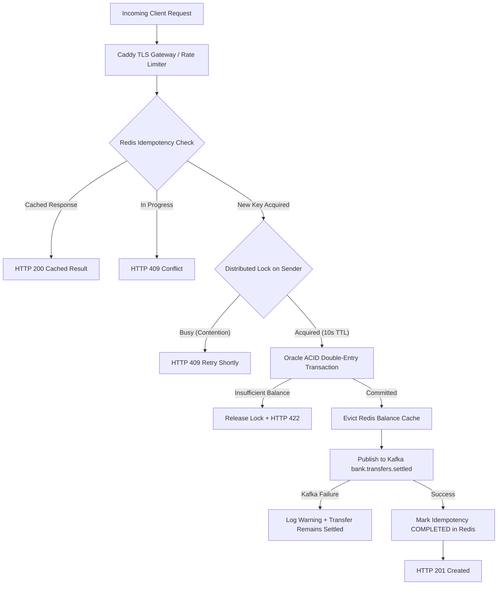

# IndiBank Core Engine - Site Reliability Engineering (SRE) Framework
> **Production Reliability, Observability, SLOs, and Operational Runbooks**  
> Target System: **IndiBank Core Transaction & Ledger Engine**

---

## 1. Executive Summary & SRE Philosophy

In mission-critical digital core banking and interbank clearing systems (**BI-FAST**, Real-Time Gross Settlement, Intra-bank transfer), reliability is defined by **consistency, durability, and predictability**. 

The IndiBank SRE strategy is anchored on four pillars:
1. **Zero-Loss Ledger Invariance:** Absolute mathematical balance across all journal lines ($\sum \text{Debit} \equiv \sum \text{Credit}$).
2. **Defensive Concurrency:** Deterministic idempotency guards and distributed locking preventing race-condition double-spending.
3. **Blast-Radius Containment:** Isolated Blue-Green environments, ephemeral feature testing domains, and asynchronous decoupling via Kafka DLQs.
4. **Continuous Telemetry:** Standardized Prometheus metrics, distributed trace propagation (`X-Correlation-ID`), and automated health probes.

---

## 2. Service Level Objectives (SLOs) & Service Level Indicators (SLIs)

### 📊 Production Service Level Commitments

| Category | Service Level Indicator (SLI) | Target (SLO) | Measurement Window | Error Budget |
| :--- | :--- | :--- | :--- | :--- |
| **Availability** | $\frac{\text{Successful Transfer Responses (HTTP 2xx)}}{\text{Total Valid Requests}}$ | **$\ge 99.99\%$ (Four Nines)** | Rolling 30 Days | 4.32 minutes / month |
| **Latency (p95)** | Time elapsed from HTTP ingress to ACID ledger persistence | **$\le 150 \text{ ms}$** | Rolling 7 Days | 5% of requests $> 150 \text{ ms}$ |
| **Latency (p99)** | Worst-case latency including distributed lock & Kafka publish | **$\le 500 \text{ ms}$** | Rolling 7 Days | 1% of requests $> 500 \text{ ms}$ |
| **Ledger Invariance** | $|\sum \text{Debit Lines} - \sum \text{Credit Lines}|$ | **$\equiv 0.00 \text{ IDR}$ (Zero Drift)** | Continuous (per Tx) | **0 tolerance** |
| **Idempotency Safety** | Duplicate debit transactions under network retry / replays | **$0.00\%$ Duplicate Deductions** | Continuous | **0 tolerance** |
| **RPO (Recovery Point)** | Data loss window during catastrophic infrastructure failure | **$< 1 \text{ minute}$** | Incident Window | Max 60 seconds event replay |
| **RTO (Recovery Time)** | Time to restore full settlement processing | **$< 5 \text{ minutes}$** | Incident Window | Max 300 seconds pod/PVC heal |

### 📉 Error Budget Policy & Burn Rate Alerting
* **1-Hour Burn Rate $\ge 14.4 \times$ (2% budget consumed in 1 hour):** Triggers `P1-CRITICAL` pager alert to on-call SRE. Automated deployment freeze.
* **6-Hour Burn Rate $\ge 6.0 \times$ (5% budget consumed in 6 hours):** Triggers `P2-HIGH` alert. Requires investigation within 15 minutes.
* **Budget Exhaustion Policy:** If the 30-day availability error budget drops below 10%, all non-essential feature deployments are suspended; engineering capacity is redirected entirely to reliability and bug fixing.

---

## 3. The Four Golden Signals & Observability

IndiBank Core exposes standard Prometheus metrics via `/actuator/prometheus` and Spring Boot Actuator:

### 1. Latency
* **Metric:** `http_server_requests_seconds{uri="/api/v1/transfers"}`
* **Measurement:** Percentile histograms ($p50, p95, p99$) for end-to-end transfer execution.
* **Target:** $p95 < 150\text{ms}$.

### 2. Traffic
* **Metric:** `http_server_requests_seconds_count{uri="/api/v1/transfers"}`
* **Measurement:** Requests per second (RPS) and aggregate throughput per currency/channel.

### 3. Errors
* **Metric:** `http_server_requests_seconds_count{status=~"5.."}`
* **Classification:**
  * `4xx`: Client / business validation errors (e.g. `422 INSUFFICIENT_FUNDS`, `400 BAD_REQUEST`, `404 NOT_FOUND`). These do not consume the availability error budget.
  * `409`: State conflicts (concurrent duplicate in-flight). Monitored for locking contention.
  * `5xx`: System errors (DB connectivity, unhandled runtime exceptions). Consumes the availability error budget.

### 4. Saturation
* **HikariCP Database Pool:**
  * `hikaricp_connections_active`: Concurrently executing Oracle queries.
  * `hikaricp_connections_pending`: Threads queued waiting for a DB connection.
  * *Alert Rule:* Pending connections $> 0$ for $> 30\text{s}$ triggers `OracleDbPoolSaturated`.
* **Kafka Consumer Lag:**
  * `kafka_consumer_fetch_manager_records_lag`: Offset delta between produced transfers and fraud screening consumers.
  * *Alert Rule:* Consumer lag $> 500$ messages for $> 60\text{s}$ triggers `KafkaConsumerLagHigh`.
* **JVM Virtual Threads & Heap:**
  * `jvm_memory_used_bytes{area="heap"}`: Heap consumption.
  * `jvm_threads_live_threads`: Active virtual and platform threads.

---

## 4. Resilience & Defensive Engineering



### 1. Distributed Lock Safety
* Account-level locks use a **10-second automatic expiration TTL** in Redis.
* Lock releases use an atomic Lua script verifying ownership token, preventing process A from accidentally releasing a lock acquired by process B after a timeout.

### 2. Idempotency Key Lifecycle
* `SETNX` with `IN_PROGRESS` state on request entry.
* If transaction fails due to business validation, key is immediately evicted to allow client correction.
* If transaction settles, full response payload is cached with **24-hour TTL**. Duplicate replays bypass database locks and return the original receipt instantaneously.

### 3. Graceful Degradation & Cache Fallback
* If Redis cache is temporarily degraded:
  * Balance queries fall back transparently to Oracle DB (`AccountRepository.findByAccountNumber`).
  * Cache eviction errors are caught and logged as warnings without failing the underlying monetary settlement.

---

## 5. Zero-Downtime Deployment & Blast Radius Control

* **Blue-Green Architecture:**
  * Two identical production deployments: `indibank-core-blue` and `indibank-core-green`.
  * Traffic cutover is executed by patching the Kubernetes Service selector (`spec.selector.slot`).
  * **Instant Rollback:** If health checks degrade post-cutover, reverting to the former slot takes $< 1$ second:
    ```bash
    kubectl patch service indibank-core -n indibank -p '{"spec":{"selector":{"slot":"blue"}}}'
    ```
* **Ephemeral Feature Previews:**
  * Every feature branch builds an isolated preview pod accessible at the configured preview domain.
  * Manual and automated exploratory testing is completed in preview before merging to `main`.
* **Zero Direct Push to `main`:**
  * Enforced via GitHub Branch Protection (`enforce_admins: true`) with a mandatory $\ge 95\%$ JaCoCo test coverage gate.

---

## 6. Incident Response Standard Operating Procedures (SOPs)

### SOP-01: High 5xx Error Rate / Unhandled Banking Exceptions
1. **Assess Impact:** Check live dashboard (`http://localhost:8080` or configured ingress) and Prometheus `/actuator/metrics`.
2. **Inspect Logs:**
   ```bash
   kubectl logs -n indibank -l app=indibank-core --tail=100 | grep -E "ERROR|Exception"
   ```
3. **If Database Connectivity Lost:**
   Check Oracle pod state:
   ```bash
   kubectl describe pod -l app=oracle-db -n indibank
   ```
4. **Trigger Instant Rollback (if caused by new release):**
   ```bash
   ACTIVE_SLOT=$(kubectl get service indibank-core -n indibank -o jsonpath='{.spec.selector.slot}')
   ROLLBACK_SLOT=$([ "$ACTIVE_SLOT" == "blue" ] && echo "green" || echo "blue")
   kubectl patch service indibank-core -n indibank -p "{\"spec\":{\"selector\":{\"slot\":\"$ROLLBACK_SLOT\"}}}"
   ```

### SOP-02: Kafka Consumer Lag / AML Worker Stall
1. **Check Consumer Group Lag:**
   ```bash
   kubectl exec -it deployment/kafka -n indibank -- /opt/kafka/bin/kafka-consumer-groups.sh \
     --bootstrap-server localhost:9092 --describe --group indibank-fraud-detector
   ```
2. **Inspect In-Memory Stream Ticker:**
   Query `/api/v1/events/recent` to inspect recent messages and verify consumer health.
3. **Restart Consumer Pods (if deadlock detected):**
   ```bash
   kubectl rollout restart deployment/indibank-core-green -n indibank
   ```

### SOP-03: Stuck Distributed Locks (Redis Contention Spike)
1. **Check Active Locks in Redis:**
   ```bash
   kubectl exec -it deployment/redis -n indibank -- redis-cli KEYS "indibank:lock:*"
   ```
2. **Force-Release Stale Lock (if account is blocked):**
   ```bash
   kubectl exec -it deployment/redis -n indibank -- redis-cli DEL "indibank:lock:1001002001"
   ```
