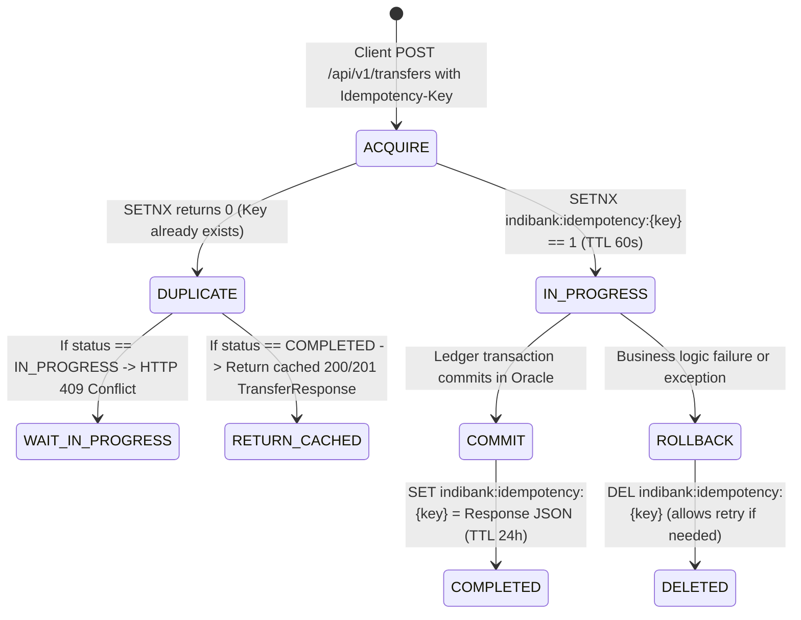

# Redis Data Structure & Concurrency Specification

## 1. Overview
In the IndiBank Core Ledger Engine, Redis provides three mission-critical capabilities:
1. **Idempotency Guard**: Guarantees that no financial transfer can be executed twice within a 24-hour window, even during aggressive network retries.
2. **Distributed Account Lock**: Prevents race conditions and double-spending when multiple concurrent transfer requests target the same sender account.
3. **Fast-Read Balance Cache**: Serves sub-millisecond account balance lookups with automatic eviction/write-through on ledger settlement.

---

## 2. Key Namespace Conventions

| Key Pattern | Redis Type | TTL | Purpose |
| :--- | :--- | :--- | :--- |
| `indibank:idempotency:{idempotencyKey}` | `String` (JSON) | 86,400s (24h) | Stores idempotency state: `IN_PROGRESS` (with lock) or `COMPLETED` (cached HTTP response). |
| `indibank:lock:account:{accountNumber}` | `String` (Token) | 10s | Distributed mutex lock while debiting the source account. Auto-releases on commit/rollback. |
| `indibank:cache:balance:{accountNumber}` | `String` (JSON) | 300s (5m) | Cached balance and account metadata. Evicted immediately after Oracle ledger commit. |
| `indibank:ratelimit:{accountNumber}` | `Integer` | 60s (1m) | Sliding velocity counter (max 30 transactions/minute) to mitigate flood attacks. |

---

## 3. Idempotency State Machine



---

## 4. Distributed Locking Protocol
- **Acquisition**: `SET indibank:lock:account:{accountNumber} {UUID} NX PX 10000`
- **Release**: Evaluated using a Lua script to ensure only the lock owner releases the lock:
```lua
if redis.call("get", KEYS[1]) == ARGV[1] then
    return redis.call("del", KEYS[1])
else
    return 0
end
```
